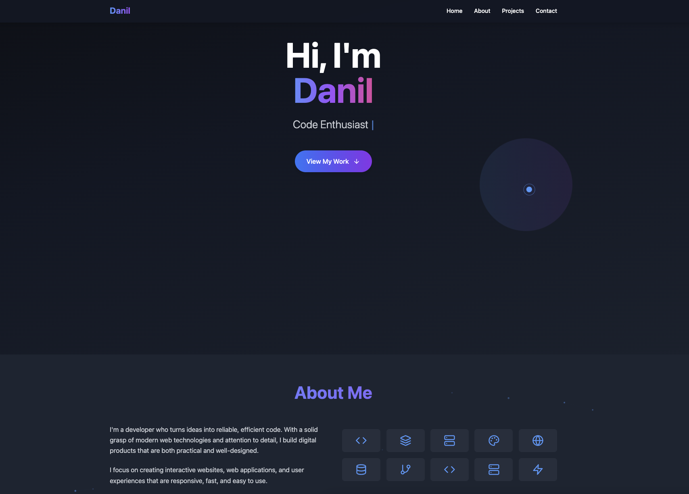

# Modern & Interactive Developer Portfolio

A **personal portfolio website** built to showcase software projects, skills, and experience through a clean, modern, and interactive user interface.

---

## 📖 Story of the Build

This project was born from the desire to create a personal digital space that is more than just a static page. I wanted to build a portfolio that not only lists my work but also demonstrates my passion for web development and my skills in creating engaging user experiences.

The goal was to design and develop a fast, visually appealing, and responsive single-page application. I focused on incorporating subtle, performant animations like a dynamic particle background and a custom cursor to make the site feel alive and memorable, without compromising on performance. The entire application is built from the ground up using a modern, component-based architecture.

---

## 🔑 What It Does (Core Capabilities)

- 🎨 **Visually Engaging UI**
  - A dynamic, animated particle background built with the HTML5 Canvas API.
  - A custom-animated cursor that provides satisfying feedback on interactive elements.

- 🧱 **Structured & Modular Content**
  - **Hero Section**: A welcoming introduction.
  - **About Section**: A brief about my background and skills.
  - **Projects Section**: A clean grid to showcase my work with links and descriptions.
  - **Contact Section**: A clear call-to-action for reaching out.

- 📱 **Fully Responsive Design**
  - Adapts seamlessly to all screen sizes, from mobile phones to desktops, thanks to a utility-first CSS approach.

- ⚡️ **High Performance**
  - Built with Vite for lightning-fast development and optimized production builds.
  - Minimal dependencies and lightweight animations ensure quick load times.

---

## 📸 Preview

---

## 🧠 Why It’s Modern & Performant

- **Vite Build Tool**: Provides an extremely fast development experience with Hot Module Replacement (HMR) and generates a highly optimized, bundled output for production.
- **React + TypeScript**: A robust, component-based architecture with the safety and scalability of static typing.
- **Tailwind CSS**: A utility-first CSS framework that allows for rapid, custom UI development directly in the markup without writing custom CSS.
- **Performant Animations**:
  - The background uses the **native HTML5 Canvas API** for a lightweight particle animation that doesn't block the main thread.
  - The custom cursor uses simple, efficient **CSS transitions**, ensuring a smooth feel without performance overhead.

---

## 🧰 Tech Stack

- **Framework**: React
- **Language**: TypeScript
- **Build Tool**: Vite
- **Styling**: Tailwind CSS
- **Icons**: Lucide React
- **Linting**: ESLint

---

## 🧩 Challenges & How They Were Solved

- **Challenge**: Create a visually stunning animated background without impacting site performance or relying on heavy external libraries.
  - **Solution**: I implemented the particle system from scratch using the **HTML5 Canvas API**. This approach gives full control over the rendering loop and keeps the animation lightweight and efficient, running smoothly on a separate layer without affecting DOM performance.

- **Challenge**: Enhance the user experience with interactive details that feel premium but not distracting.
  - **Solution**: A **custom cursor** was developed using React hooks and CSS transitions. It tracks the mouse position and subtly changes its appearance when hovering over interactive elements like links or buttons, providing clear visual feedback to the user.

- **Challenge**: Ensure a clean, maintainable, and scalable codebase for a single-page application.
  - **Solution**: The application was structured into logical, reusable **React components** (`Navbar`, `Hero`, `Projects`, etc.). Using **TypeScript** added strict type-checking, which helps prevent common errors and makes the code easier to refactor and maintain.

---

## 🗺️ TL;DR

This is a **modern developer portfolio** built with **React, Vite, and Tailwind CSS**. It showcases my projects and skills through a **clean, responsive, and interactive interface**, featuring a custom-built, performant **particle animation background** and a **custom cursor** to create a memorable user experience.